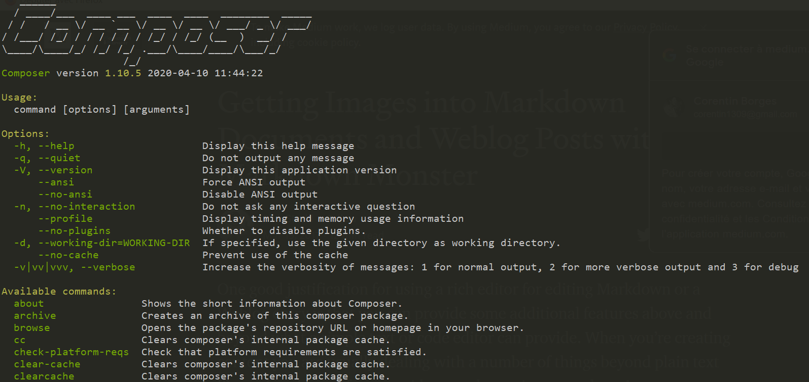

# Le Blog: Projet 5

This is my professional blog

## Installing project

1. Clone or Download the project
2. Put the folder 'project_5' to the root of your localhost
3. If you haven't composer, [Install Composer](#installing-composer).
4. Once ```composer``` is installed. Open your terminal, go to ```yourLocalhostDirectory/Projet_5``` and type ````composer install````. 
This command will install all composer's dependencys.
5. Import the blog.db file in your database
6. Configure the database infos in [this file](config/dev.php)
7. Configure the mail infos [here](config/Mail.php) (I recommend to use [MailTrap](https://mailtrap.io/) to test sending mails, 
you have a tuto at the end of this read me [How to use mailtrap](#how-to-use-mailtrap))
8. Write 'localhost/projet_5/public' in the address bar of your favorite browser and press enter

###Installing Composer
####Windows installation
1. Click  [here](https://getcomposer.org/Composer-Setup.exe) to download Composer-Setup.exe
2. double-click on the downloaded file
3. Click next and accept the default configuration

4. Click on 'Brows' and find the location of your php.exe and click 'next'
5. close your browser, open your terminal and type ```composer```.
 You must obtain something like this:

Congratulation, composer is installed!!
6. Update composer with ```composer self-update``` command

#####Mac or Linux installation
With Mac or Linux you can install composer [locally](#local-installation) or [globally](#global-installation)

#####Local installation
1. Open your terminal in the 'project_5' folder, and type those lines to install composers files in this folder
    ```
    php -r "copy('https://getcomposer.org/installer', 'composer-setup.php');"
    php -r "if (hash_file('sha384', 'composer-setup.php') === 'e0012edf3e80b6978849f5eff0d4b4e4c79ff1609dd1e613307e16318854d24ae64f26d17af3ef0bf7cfb710ca74755a') { echo 'Installer verified'; } else { echo 'Installer corrupt'; unlink('composer-setup.php'); } echo PHP_EOL;"
    php composer-setup.php
    php -r "unlink('composer-setup.php');"
    ``` 
2. You can verify if it works, typing ```php composer.phar``` you must have something similar to this screen


#####Global installation
> :warning: **You need to [install composer locally](#local-installation) first to be able to install it globally**

1. Open your terminal and go to the folder where composer is installed
2. type ```mv composer.phar /usr/local/bin/composer``` in your terminal to create a composer folder in your bin folder,
 and move ```composer.phar``` file in this composer folder.
3. Type ```composer``` in your terminal. If composer is installed you must obtain this screen:


It must work in any folders.

### How to use mailtrap
1. Got to [Mailtrap website](https://mailtrap.io/) and create an account
2. When you are connected click on the setting's icon (the wheel under 'Action')

3. You can copy and past all required information in the [configuration mail file](config/Mail.php)

## Built With
* [Composer 1.10.5](https://getcomposer.org/)
* [Twig 3.0.3](https://twig.symfony.com/)
* [swiftmailer 6.2](https://swiftmailer.symfony.com/)

